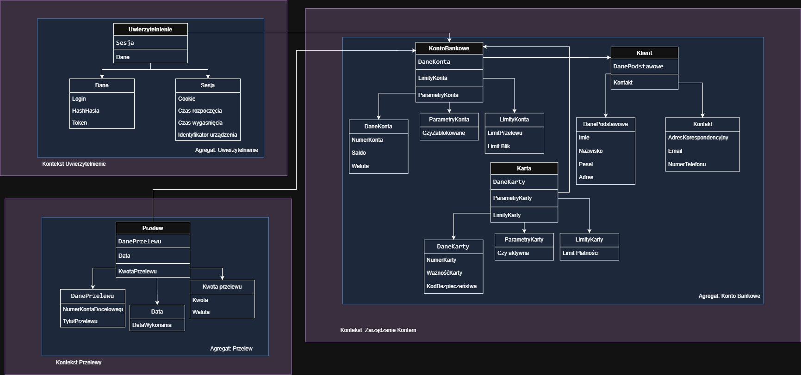

## Opis zadania

Celem projektu jest przygotowanie fragmentu modelu domenowego bezpiecznej aplikacji bankowej zgodnie z zasadami Domain Driven Design. Model obejmuje trzy Bounded Contexty: *Zarządzanie Kontem*, *Przelewy* oraz *Uwierzytelnienie*. W ramach kontekstów zdefiniowano agregaty, encje i obiekty wartości reprezentujące operacje bankowe, zarządzanie kontem oraz logikę autoryzacji. Projekt nie ma być kompletnym modelem bankowości, lecz uporządkowanym przykładem zastosowania DDD.

---

---

## Bounded Contexts

### 1. Zarządzanie Kontem

Kontekst odpowiedzialny za dane konta bankowego oraz operacje wpływające na stan konta.

#### Agregat
- **KontoBankowe**

#### Encje

1. KontoBankowe
    - **DaneKonta**
    - **ParametryKonta**
    - **LimityKonta**

1. Klient
    - **DanePodstawowe**
    - **Kontakt**

1. Karta
    - **DaneKarty**
    - **ParametryKarty**
    - **LimityKarty**

#### Value Objects

1. DaneKonta
    - **NumerKonta** number
    - **Saldo** number
    - **Waluta** string

1. ParametryKonta
    - **CzyZablokowane** bool

1. LimityKonta
    - **LimitPrzelewu** number
    - **Limit Blik** number

1. DanePodstawowe
    - **Imie** string
    - **Nazwisko** string
    - **Adres** string
    - **Pesel** string

1. Kontakt
    - **AdresKorespondencyjny** string
    - **Email** string (wymuszenie regexem @)
    - **NumerTelefonu** number

1. DaneKarty
    - **NumerKarty** number
    - **WażnośćKarty** date
    - **KodBezpieczeństwa** number

1. ParametryKarty
    - **Czy aktywna** bool

1. LimityKarty
    - **Limit Płatności** Number
---

### 2. Przelewy

Kontekst odpowiedzialny za inicjowanie i obsługę przelewów wychodzących.

#### Agregat
- **Przelew**

#### Encje
1. Przelew
    - **DanePrzelewu** 
    - **KwotaPrzelewu**
    - **Data**

#### Value Objects

1. Daneprzelewu
    - **NumerKontaDocelowego** number
    - **TytułPrzelewu** string

1. Kwota przelewu
    - **Kwota** number
    - **Waluta** string

1. Data
    - **DataWykonania** date

---

### 3. Uwierzytelnienie

Kontekst odpowiadający za zarządzanie tożsamością użytkownika i dostępem do operacji.

#### Agregat
- **Uwierzytelnienie**

#### Encje
1. Uwierzytelnienie
    - **Sesja**
    - **Dane**

#### Value Objects

1. Sesja
    - **Cookie** string
    - **Czas rozpoczęcia** date
    - **Czas wygaśnięcia** date
    - **Identyfikator urządzenia** string

1. Dane
    - **Login** string, number
    - **HashHasła** string
    - **TokenSesyjny** string

## Integracja między kontekstami

- **Przelewy → Zarządzanie Kontem**  
  Przelew przed wykonaniem sprawdza saldo konta poprzez usługę domenową (domain service) lub przez port w warstwie aplikacyjnej. Wywołanie powinno być asynchroniczne (event/command) lub poprzez bezpieczny synchronizowany port z ograniczeniem czasowym.

- **Uwierzytelnienie → Przelewy / Zarządzanie Kontem**  
  Uwierzytelnienie dostarcza token sesyjny wymagany przed wykonaniem operacji na koncie lub inicjowaniem przelewu. Walidacja uprawnień odbywa się w warstwie aplikacyjnej przed wykonaniem operacji w agregacie.

## Inne operacje

1. W obrębie tego samego kontekstu:
- Klient może zmienić limity karty, czy też konta bankowego
- Klient może zmienić dane kontaktowe
